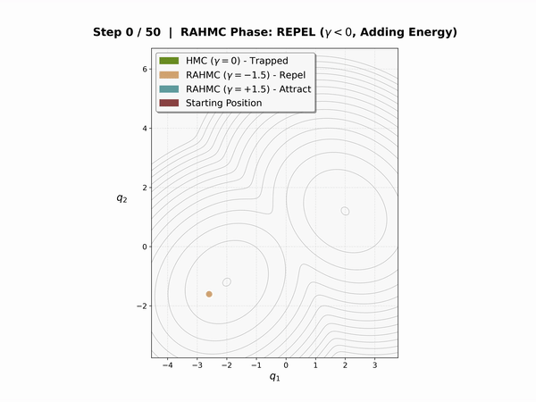

# MCMC Samplers with Adaptive Friction

A JAX-based research codebase for developing and benchmarking MCMC samplers, with emphasis on Generalized Repelling-Attracting Hamiltonian Monte Carlo (GRAHMC) featuring time-varying friction schedules.

<p align="center">
  
</p>

<p align="center">
  <em>RAHMC escapes local modes through repelling-attracting dynamics, while standard HMC remains trapped.</em>
</p>

## Features

- **Multiple MCMC Samplers**: Random Walk Metropolis-Hastings (RWMH), Hamiltonian Monte Carlo (HMC), No-U-Turn Sampler (NUTS), and Generalized RAHMC (GRAHMC)
- **Five Friction Schedules**: constant, tanh, sigmoid, linear, and sine for time-varying friction dynamics
- **Fixed-Budget Benchmarking**: Systematic evaluation with fixed sample budgets and convergence tracking
- **Two-Tier Quality Gates**: Usable (hard gate) vs Quality Pass thresholds for filtering results
- **Trajectory Length Optimization**: Automatic grid search for optimal L in HMC/GRAHMC
- **Automated Parameter Tuning**: Dual averaging for step size, windowed mass matrix adaptation, sequential friction tuning
- **Comprehensive Diagnostics**: ESS (bulk/tail), R-hat, z-score validation, Sliced Wasserstein-2 distance
- **Parallel Chain Execution**: Efficient batched sampling via JAX's `vmap()`

## Installation

```bash
pip install -r requirements.txt
```

**Requirements**: JAX, Optax, ArviZ, NumPy, Matplotlib, Seaborn

**Important**: Enable float64 precision for numerical stability:
```python
import jax
jax.config.update("jax_enable_x64", True)
```

## Quick Start

### Basic Sampling

```python
import jax
import jax.numpy as jnp
from jax import random
from samplers.GRAHMC import rahmc_run, get_friction_schedule

jax.config.update("jax_enable_x64", True)

# Define target distribution (10D standard normal)
def log_prob_fn(x):
    return -0.5 * jnp.sum(x**2, axis=-1)

# Run GRAHMC with tanh schedule
key = random.PRNGKey(0)
init_position = random.normal(key, shape=(4, 10)) * 2.0  # 4 chains, 10 dimensions

samples, log_probs, accept_rate, final_state = rahmc_run(
    key, log_prob_fn, init_position,
    num_samples=1000,
    burn_in=500,
    step_size=0.05,
    num_steps=16,
    gamma=1.0,
    steepness=0.5,  # default for tanh
    friction_schedule=get_friction_schedule('tanh')
)

print(f"Acceptance rate: {jnp.mean(accept_rate):.3f}")
print(f"Samples shape: {samples.shape}")  # (1000, 4, 10)
```

### Running Benchmarks

```bash
# Run benchmarks on specific targets (default: 10D, 4 chains, 2500 warmup)
python run_benchmarks.py --targets standard_normal rosenbrock

# Run all targets at 20D
python run_benchmarks.py --all-targets --dim 20

# With convergence tracking (logs Sliced W2 at checkpoints)
python run_benchmarks.py --targets neals_funnel --track-convergence

# Custom trajectory length grid for HMC/GRAHMC
python run_benchmarks.py --dim 20 --num-steps-grid 16 32 64 128

# Specific samplers and schedules
python run_benchmarks.py --samplers hmc grahmc --schedules tanh sigmoid

# Without mass matrix learning (identity mass)
python run_benchmarks.py --mass-matrix-mode no-mass
```

### Analyzing Results

```bash
# Generate research plots
python analyze_benchmarks.py benchmark_results/ --research --output plots/

# Grid search analysis for trajectory lengths
python analyze_benchmarks.py benchmark_results/ --L-all
```

## Project Structure

```
.
├── samplers/                    # Core MCMC implementations
│   ├── RWMH.py                 # Random Walk Metropolis-Hastings
│   ├── HMC.py                  # Hamiltonian Monte Carlo
│   ├── NUTS.py                 # No-U-Turn Sampler
│   └── GRAHMC.py               # Generalized RAHMC with friction schedules
├── tuning/                      # Parameter tuning framework
│   ├── core.py                 # Main tuning orchestration
│   ├── dual_averaging.py       # Dual averaging algorithms
│   ├── adaptation.py           # Windowed adaptation with mass matrix
│   ├── welford.py              # Online mean/variance estimation
│   └── plots.py                # Diagnostic visualization
├── benchmarks/                  # Benchmarking infrastructure
│   ├── targets.py              # Target distribution definitions
│   └── metrics.py              # Quality metrics and gates
├── analysis/                    # Results analysis utilities
│   ├── utils.py                # Data loading and processing
│   ├── grid_analysis.py        # L grid search analysis
│   └── research_plots.py       # Visualization utilities
├── animations/                  # Sampler comparison visualizations
├── run_benchmarks.py           # Main benchmark runner
├── analyze_benchmarks.py       # Results analysis CLI
└── requirements.txt
```

## Samplers

### Random Walk Metropolis-Hastings (RWMH)
Basic random walk with Gaussian proposals. Target acceptance: **0.234** (Roberts & Rosenthal optimal).

### Hamiltonian Monte Carlo (HMC)
Leapfrog integration with configurable step size, trajectory length, and diagonal mass matrix. Target acceptance: **0.65**.

### No-U-Turn Sampler (NUTS)
Automatic trajectory length selection via iterative tree doubling with U-turn detection. JIT-compatible implementation using `lax.while_loop`.

### GRAHMC
Generalized Repelling-Attracting HMC with time-varying friction. The friction coefficient γ(t) transitions from negative (repelling/accelerating) to positive (attracting/damping) during each trajectory.

**Friction Schedules:**
| Schedule | Formula | Steepness Default |
|----------|---------|-------------------|
| `constant` | γ(t) = -γ if t<T/2 else +γ | N/A |
| `tanh` | γ(t) = γ_max × tanh(s×(2t/T - 1)) | 0.5 |
| `sigmoid` | γ(t) = γ_max × (2/(1+exp(-s×(t/T-0.5))) - 1) | 2.0 |
| `linear` | γ(t) = -γ + 2γ×t/T | N/A |
| `sine` | γ(t) = γ × sin(π×(t/T - 0.5)) | N/A |

## Target Distributions

| Target | Challenge | Key Properties |
|--------|-----------|----------------|
| `standard_normal` | Baseline | N(0, I), well-conditioned |
| `correlated_gaussian` | High correlation | Compound symmetry, ρ=0.9 |
| `ill_conditioned_gaussian` | Step size tuning | Condition number κ=100 |
| `neals_funnel` | Varying curvature | Hierarchical, exp-varying scale |
| `student_t` | Heavy tails | df=3, challenges momentum control |
| `rosenbrock` | Curved valleys | Non-linear correlations, narrow ridge |
| `log_gamma` | Asymmetry | Heavy tails, positivity constraints |
| `gaussian_mixture` | Multimodality | Bimodal in first dimension |

## Benchmarking System

### Fixed-Budget Approach

The benchmarking system allocates a fixed sample budget (default: 10,000 samples × 4 chains) and measures performance within that budget:

1. **Adaptive Warmup** (2,500 steps): Step size tuning, mass matrix learning, friction optimization
2. **Production Sampling**: Fixed budget collection with optional convergence tracking
3. **Diagnostic Computation**: R-hat, ESS, z-scores, Sliced W2 distance

### Two-Tier Quality Gates

Results are filtered through two quality tiers:

**Usable (Hard Gate)** - Minimum standard for comparison:
- R-hat < 1.05
- ESS bulk ≥ 400
- ESS tail ≥ 100
- Divergence rate < 5%

**Quality Pass** - Strict standard:
- R-hat < 1.01
- ESS bulk ≥ 400
- ESS tail ≥ 200
- Divergence rate < 1%
- Z-score test passes (Bonferroni-corrected)

### Trajectory Length Grid Search

For HMC and GRAHMC, the system tests a grid of trajectory lengths (default: [8, 16, 24, 32, 48, 64, 96]) and selects the optimal L by ESS/gradient efficiency, preferring quality_pass runs over merely usable ones.

### Incremental Save/Resume

Benchmark results are saved incrementally after each configuration, allowing runs to resume from interruptions.

## Tuning Framework

### Dual Averaging
Based on Hoffman & Gelman (2014), automatically adjusts step size to achieve target acceptance rates:
- **RWMH**: Target 0.234
- **HMC/NUTS**: Target 0.65
- **GRAHMC**: Target 0.55

### Mass Matrix Adaptation
Stan-style windowed warmup with Welford's online algorithm:
1. **Exploration phase** (500 steps): Initial step size tuning
2. **Adaptation windows** (fixed: 25, 50, 100, 200, 500, 1000): Learn diagonal mass matrix
3. **Cooldown phase** (125 steps): Final step size refinement

Shrinkage regularization prevents extreme variance estimates.

### GRAHMC Sequential Tuning

Friction parameters are tuned **sequentially** (not jointly) because they have opposite relationships with acceptance rate:

1. **Phase 1**: Tune step size via dual averaging with conservative γ=0.5
2. **Phase 2**: Tune gamma via ESJD (Expected Squared Jump Distance) grid search
3. **Steepness**: Fixed at schedule-specific defaults (0.5 for tanh, 2.0 for sigmoid)

This approach correctly optimizes gamma for exploration quality rather than just acceptance rate.

## Key Design Principles

- **Position arrays**: Always batched as `(n_chains, n_dim)` for parallel execution
- **Numerical precision**: Float64 for log probabilities and energy calculations
- **JIT compilation**: All sampling loops compiled for performance
- **Fixed-budget evaluation**: Comparable assessment across samplers
- **Quality gates**: Two-tier filtering for reliable results
- **Incremental saving**: Resumable benchmarking runs

## Citation

If you use this code in your research, please cite the relevant papers on Repelling-Attracting HMC:

- Vishwanath & Tak (2024) - [Repelling-Attracting Hamiltonian Monte Carlo](https://arxiv.org/abs/2403.04607)
